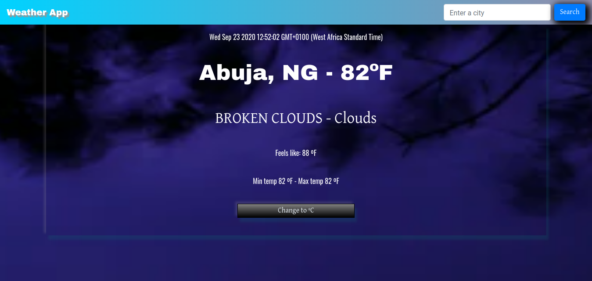

# weather app

This is a weather forecast site built using a weather API. Requirements can be seen from The [Odin Curriculum](https://www.theodinproject.com/courses/javascript/lessons/weather-app).

## Live demo

[live demo](https://jovial-bell-2d2a8d.netlify.app/)

- Screenshot

## Built With

- Javascript
- HTML
- CSS
- Bootstrap
- Webpack
- The OpenWeatherMap API

## Getting Started 

	To get a local copy up and running follow these simple example steps.

## Prerequisites

    npm
	webpack

## Setup

	Clone the repository.
	Run npm install to install dependencies.
	Run npm start to start the development server.
	Your browser should open. Click on the dist folder to see the app.

## Authors

👤 **Ignatius Sani**

- Github: [ignatius22](https://github.com/ignatius22)
- Twitter: [@Iggy_code](https://twitter.com/iggy_code)
- Linkedin: [linkedin](https://www.linkedin.com/in/ignatiussani)

## 🤝 Contributing

Contributions, issues and feature requests are welcome!

Feel free to check the <a href="https://github.com/ignatius22/Weather-app.git/issues" target="_blank">issues page</a>.

## Show your support

Give a ⭐️ if you like this project!

## Acknowledgments
 
- <a href="https://www.microverse.org/" target="_blank">Microverse</a>